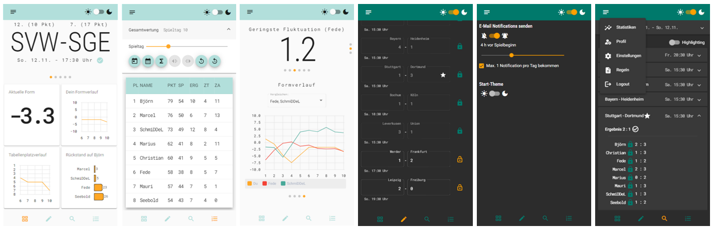

# Tgbfms

A mobile-optimized football-bet Web App.

The frontend is built on Google's [Angular](https://angular.io/) and uses 
Google's [Material V2](https://m2.material.io/) components.

The App is hosted on Google's [Firebase](https://firebase.google.com/) and uses several backend services, but first and foremost:

- [Firebase](https://firebase.google.com/): Firestore as a database and safe authentication services
- [Google Cloud Platform](https://cloud.google.com/): Time-scheduled functions like notifications, database synchronization tasks and many other
- [OpenLigaDB](https://www.openligadb.de/): Yields fresh and recent results of all matches for the synchronization of the database